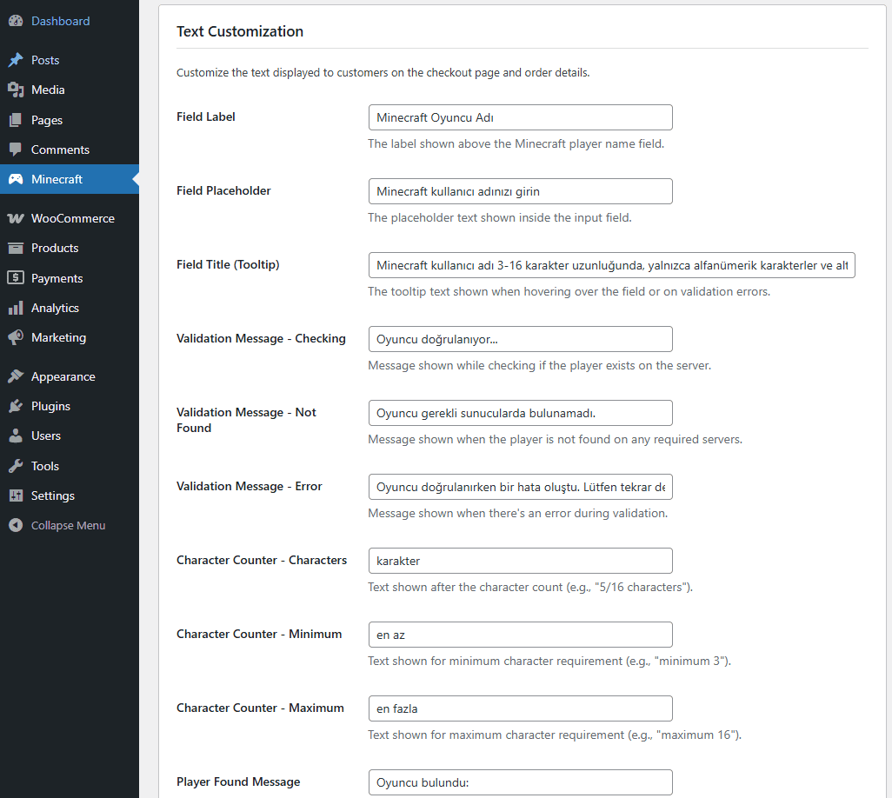

# MineWebStore Integration

[](https://opensource.org/licenses/MIT)
[](https://wordpress.org/plugins/)
[](https://minecraft.net/)
[](https://adoptium.net/)

**MineWebStore Integration** is a comprehensive solution that bridges WooCommerce e-commerce platforms with Minecraft servers, enabling automatic command execution when products are purchased. This system consists of two main components: a WordPress plugin for WooCommerce integration and a Minecraft server plugin for command processing.

## 🚀 Features

### Core Functionality
- **Automatic Command Execution**: Execute Minecraft commands automatically when WooCommerce orders are completed
- **Multi-Server Support**: Manage multiple Minecraft servers from a single WordPress installation
- **Player Validation**: Validate Minecraft player names against server player databases
- **Real-time Synchronization**: Instant command delivery and status updates between WordPress and Minecraft
- **HPOS Compatibility**: Full support for WooCommerce High-Performance Order Storage

### Advanced Features
- **Flexible Command Modes**: Support for both "online-only" and "always-run" command execution
- **Command Queuing**: Queue commands for offline players with automatic execution when they join
- **Product Variations**: Support for WooCommerce product variations with individual command configurations
- **Status Tracking**: Comprehensive command status tracking (pending, read, executed, failed)
- **Bulk Operations**: Bulk management of commands and orders through WordPress admin
- **Custom Order Statuses**: Dedicated order statuses for Minecraft-related processing

## � Screenshots

### WordPress Admin Panel

*Main WordPress admin panel showing MineWebStore integration settings*


*Detailed configuration panel for server management and settings*

### WooCommerce Product Configuration

*Product configuration page showing Minecraft integration settings and command configuration*

### Customer Checkout Experience

*Successful player name validation during checkout process*


*Player name validation error when username doesn't exist on the server*

### Minecraft Server Integration

*Server console showing MineWebStore plugin activity and command execution logs*

## �📋 Requirements

### WordPress Component
- **WordPress**: 6.0 or higher (tested up to 6.8.2)
- **WooCommerce**: 8.0 or higher (tested up to 10.0.4)
- **PHP**: 8.0 or higher (tested with 8.2)
- **MySQL**: 8.0 or higher
- **HPOS**: Compatible with High-Performance Order Storage

### Minecraft Component
- **Minecraft Server**: 1.18.x - 1.21.x (Paper/Spigot/Bukkit)
- **Java**: 17 - 21
- **Server Software**: Paper (recommended), Spigot, or Bukkit

## 📦 Installation

### WordPress Plugin Installation

#### Method 1: WordPress Plugin Store (Recommended)
1. Navigate to your WordPress Admin Panel
2. Go to **Plugins** → **Add New**
3. Search for "MineWebStore Integration"
4. Click **Install Now** and then **Activate**

#### Method 2: Manual Installation
1. Download the latest release from the [WordPress Plugin Directory](https://wordpress.org/plugins/)
2. Upload the plugin files to `/wp-content/plugins/minewebstore/`
3. Activate the plugin through the WordPress admin panel

### Minecraft Plugin Installation
1. Download the latest `minewebstore-1.0.0.jar` from the [Releases](https://github.com/Akaliix/MineWebStore/releases) page
2. Place the jar file in your server's `plugins/` folder
3. Restart your Minecraft server
4. Configure the plugin using the generated `config.yml` file

## ⚙️ Configuration

### WordPress Configuration
1. Go to **Minecraft** in your WordPress admin menu
2. Generate a **Secret Key** for secure communication
3. Add your Minecraft servers with their connection details
4. Configure checkout field settings and text customization

### Minecraft Server Configuration
Edit the `config.yml` file in your `plugins/MineWebStore/` folder:

```yaml
wordpress:
  base_url: "https://yourdomain.com"
  secret_key: "your-generated-secret-key"

server:
  name: "Survival-1"
  poll_interval: 10

debug:
  enabled: false
  log_api_calls: false
```

### Product Configuration
1. Edit any WooCommerce product
2. Scroll to the **Minecraft Integration** section
3. Select the target Minecraft server
4. Add commands using `%player%` placeholder for the player name
5. Configure command execution modes (online-only or always-run)
6. Set command delay intervals if needed

## 🎮 Usage

### For Store Owners
1. **Product Setup**: Configure Minecraft commands for your products
2. **Server Management**: Add and manage multiple Minecraft servers
3. **Order Monitoring**: Track command execution status in real-time

### For Customers
1. **Shopping**: Add Minecraft products to cart as usual
2. **Checkout**: Enter Minecraft username when purchasing Minecraft products
3. **Validation**: System validates username exists on the target server
4. **Delivery**: Commands are executed automatically after payment

### For Server Administrators
1. **Monitor**: Use `/mws status` to check plugin status
2. **Test**: Use `/mws test` to verify WordPress connectivity
3. **Reload**: Use `/mws reload` to reload configuration
4. **Logs**: Monitor server logs for command execution details

## 📝 Command Examples

### Basic Commands
```
give %player% diamond 64
tp %player% 100 64 100
gamemode creative %player%
```

### Advanced Commands with Delays
```
tell %player% Welcome to our server!
give %player% diamond_sword 1
give %player% iron_ingot 32
```

### Permission-based Commands
```
lp user %player% group add vip
region addmember spawn %player%
kit give %player% starter
```

## 🔧 API Documentation

### REST API Endpoints
- `GET /wp-json/mcapi/v1/status` - Health check
- `POST /wp-json/mcapi/v1/register` - Server registration
- `GET /wp-json/mcapi/v1/commands` - Fetch pending commands
- `POST /wp-json/mcapi/v1/commands/read` - Mark commands as read
- `PUT /wp-json/mcapi/v1/commands/{id}` - Update command status

### Authentication
All API endpoints use the secret key for authentication via the `X-Secret-Key` header.

## 🐛 Troubleshooting

### Common Issues

#### Connection Problems
- Verify WordPress URL and secret key in `config.yml`
- Check firewall settings and SSL certificates
- Ensure API endpoints are accessible

#### Command Execution Issues
- Verify player names are correct and exist on the server
- Check command syntax and permissions
- Review server logs for execution errors

### Debug Mode
Enable debug logging in minecraft plugin

**Minecraft**: Set `debug.enabled: true` in `config.yml`

## 🔄 Version History

...

---
## 🤝 Contributing

### Development Setup
1. Fork the repository
2. Create a feature branch
3. Make your changes
4. Test thoroughly
5. Submit a pull request

## 📄 License

This project is licensed under the MIT License - see the [LICENSE](LICENSE) file for details.

## 🆘 Support

### Getting Help
- **Issues**: Report bugs on [GitHub Issues](https://github.com/Akaliix/MineWebStore/issues)
- **Discord**: Join our [Community Discord](https://discord.gg/cG8XdnXMPE)

### Professional Support
For commercial support and custom development, contact us at discord: [Community Discord](https://discord.gg/cG8XdnXMPE)
